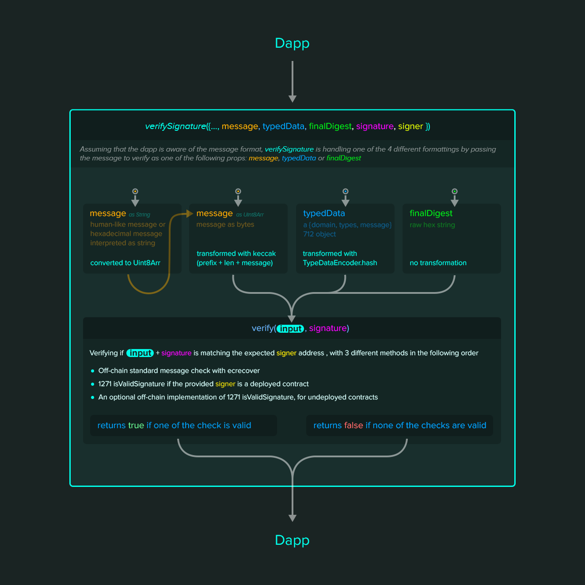

# Signature Validator library

As signatures can be daunting at times, this is a library aiming to implement universal signature verification, supporting: 

- Standard message verification (`eth_sign`)
- 712 Typed data verification (`eth_signTypedData_v*`)
- 1271 Smart contract on-chain verification (`isValidSignature`)
- An optional smart contract signature off-chain verification (eg if the smart wallet is counterfactual and not deployed yet)



### Usage

---

Simple `eth_sign` verification
```js
const ethers = require('ethers')
const { verifyMessage } = require('@ambire/signature-validator')

const provider = new ethers.providers.JsonRpcProvider('https://polygon-rpc.com')

async function run() {
	// Replace `ethers.verifyMessage(message, signature) === signer` with this:
	const isValidSig = await verifyMessage({
	    signer: '0xaC39b311DCEb2A4b2f5d8461c1cdaF756F4F7Ae9',
	    message: 'My funds are SAFU with Ambire Wallet',
	    signature: '0x9863d84f3119ac01d9e3bf9294e6c0c3572a07780fc7c49e8dc913806f4b1dbd4cc075462dc84422a9b981b2556f9c9197d76da7ba3603e53e9300869c574d821c',
	    // this is needed so that smart contract signatures can be verified
	    provider,
	})
	console.log('is the sig valid: ', isValidSig)
}
run().catch(e => console.error(e))
```

For more examples, you can check the /tests folder

### Security
A formal audit is on the roadmap.

Currently though, you can self-audit the library quite easily as it's only ~80 lines of code (index.js).

### Testing

```
npm i --development
npm test
```
